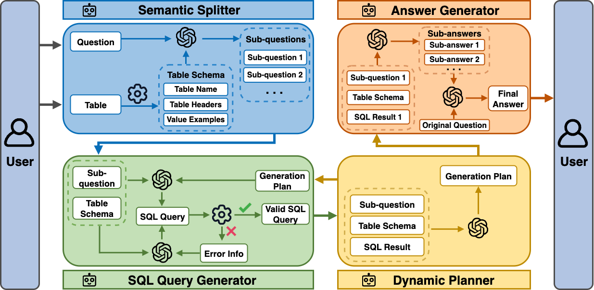

# Chain of Query
[AACL 2025 Main Conference] This is the official code for the paper [Chain-of-Query: Unleashing the Power of LLMs in SQL-Aided Table Understanding via Multi-Agent Collaboration](https://arxiv.org/abs/2508.15809)



## Environment

```shell
conda create --name coq python=3.10 -y
conda activate coq
pip install -r requirements.txt
```

## Command Usages

### Arguments

- `--model`: name of the LLM
- `--num_samples`: number of the first n samples to evaluate

### Example usages

1. Run tests on the first 20 cases with gpt-3.5-turbo-1106.

   ```shell
    python run_chain_of_query.py --model gpt-3.5-turbo-1106 --num_samples 20
   ```

2. Evaluate the baseline MAG-SQL.

   ```shell
    python run_mag_sql.py --model gpt-3.5-turbo-1106 --num_samples 20
   ```

3. Evaluate the baseline Chain-of-Table.

   ```shell
    python run_chain_of_table.py --model gpt-3.5-turbo-1106 --num_samples 20
   ```

## Cite

```bibtex
@misc{sui2025chainofqueryunleashingpowerllms,
      title={Chain-of-Query: Unleashing the Power of LLMs in SQL-Aided Table Understanding via Multi-Agent Collaboration},
      author={Songyuan Sui and Hongyi Liu and Serena Liu and Li Li and Soo-Hyun Choi and Rui Chen and Xia Hu},
      year={2025},
      eprint={2508.15809},
      archivePrefix={arXiv},
      primaryClass={cs.CL},
      url={https://arxiv.org/abs/2508.15809},
}
```

## Acknowledgement

We thank [Chain-of-Table](https://arxiv.org/abs/2401.04398) for releasing the [code](https://github.com/google-research/chain-of-table/tree/main), [MAG-SQL](https://arxiv.org/abs/2408.07930) for releasing the [code](https://github.com/LancelotXWX/MAG-SQL), and [OpenTab](https://arxiv.org/abs/2402.14361) for releasing the [code](https://github.com/amazon-science/llm-open-domain-table-reasoner).